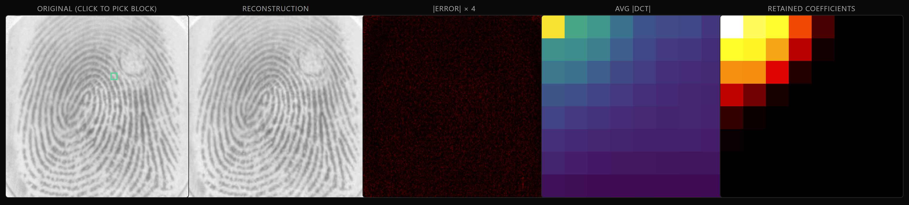
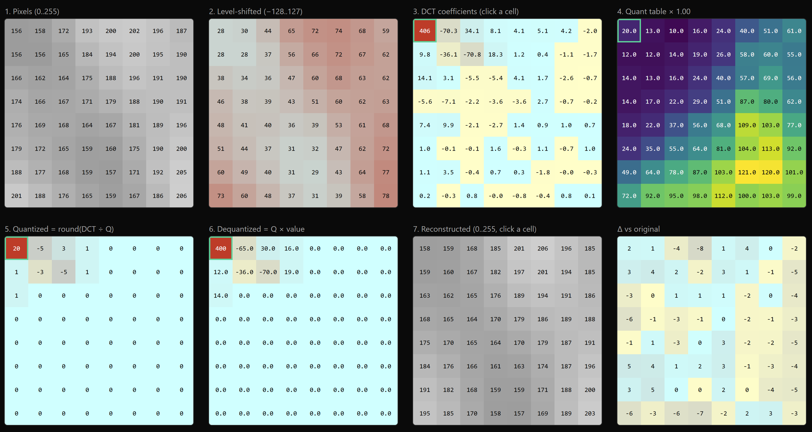
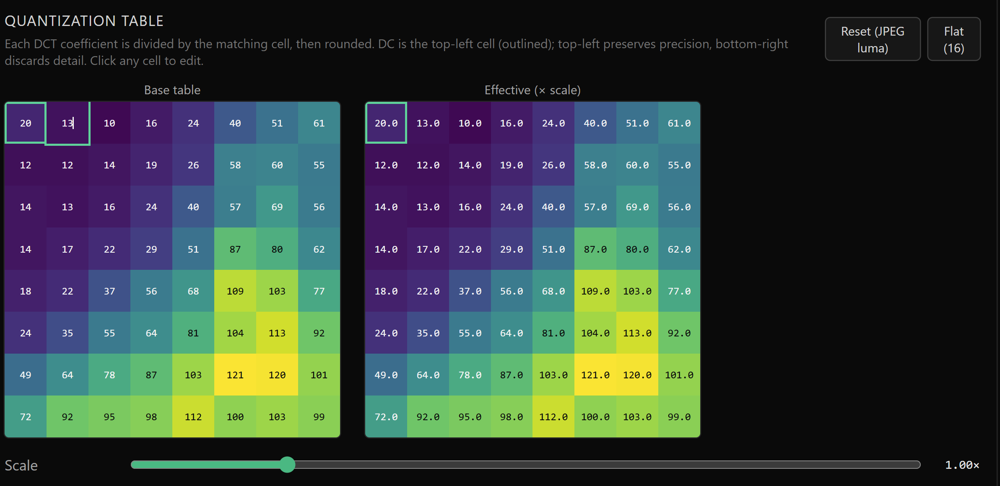

# Discrete Fourier Transform on Fingerprints

Interactive 2D DCT explorer for grayscale fingerprint images. Implements the
JPEG-style 8×8 block pipeline — level-shift, forward DCT, divide-by-table and
round, dequantize, inverse DCT — and shows the original, the reconstruction,
the per-pixel error, the average magnitude spectrum, and a frequency-bin
retention mask side by side. The quantization table is editable, and PSNR /
MSE / retention % / bits-per-pixel update live.



The top row, left to right: the original (click any 8×8 block to inspect it),
the reconstruction, the per-pixel error (×4), the average magnitude spectrum,
and the frequency-bin retention mask.

## Run

```bash
cd app
npm install
npm run dev
```

Then open http://localhost:5173.

Other scripts: `npm run build`, `npm run lint`, `npm run preview`.

## Data

The app expects grayscale `.tif` fingerprint files. The included filename
pattern (`101_1.tif` … `110_8.tif`, 10 subjects × 8 impressions each) is from
**FVC2000 DB1_B**:

http://bias.csr.unibo.it/fvc2000/download.asp

Data files are **not** included in this repo. To set up locally:

1. Download FVC2000 DB1_B from the link above.
2. Drop the `.tif` files into `fingerprints/` at the repo root.
3. Mirror them into `app/public/fingerprints/` (the Vite dev server serves
   `app/public/` at the site root).
4. Create `app/public/fingerprints.json` with a JSON array of the filenames
   you want listed in the picker, e.g.:

   ```json
   ["101_1.tif", "101_2.tif", "102_1.tif"]
   ```

Any other grayscale TIFFs work too — just list them in
`app/public/fingerprints.json`.

## How it works

For each 8×8 block of the input:

1. Scale [0,1] → [0,255], level-shift to [-128, 127].
2. 2D orthonormal Type-II DCT (row-column, direct evaluation — N is small).
3. Divide each coefficient by `quantTable × scale`, round to an integer.
4. Multiply back, inverse DCT, add 128 to return to pixel space.
5. Reassemble blocks, crop to the original dimensions.

Selecting a block walks every stage numerically, from raw pixels through the
quantized coefficients to the reconstructed block and its error against the
original:



Tweak the quantization table or the global scale to see how aggressively the
high-frequency bins get zeroed out, what that does to the reconstruction, and
how PSNR and the retention mask respond. Each cell of the table is editable,
and the scale slider multiplies the whole table at once:



## Stack

React 19 · TypeScript · Vite · Tailwind · KaTeX · UTIF
